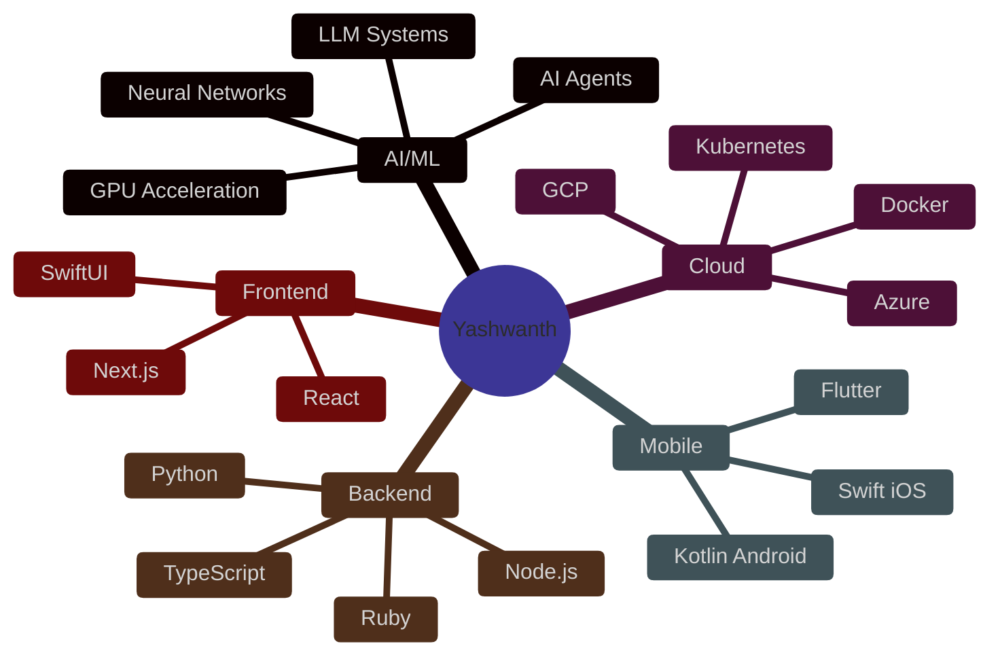
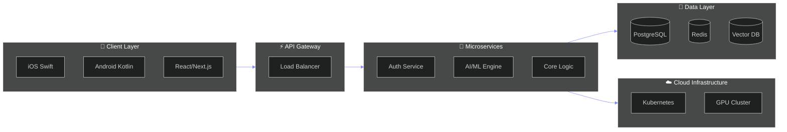
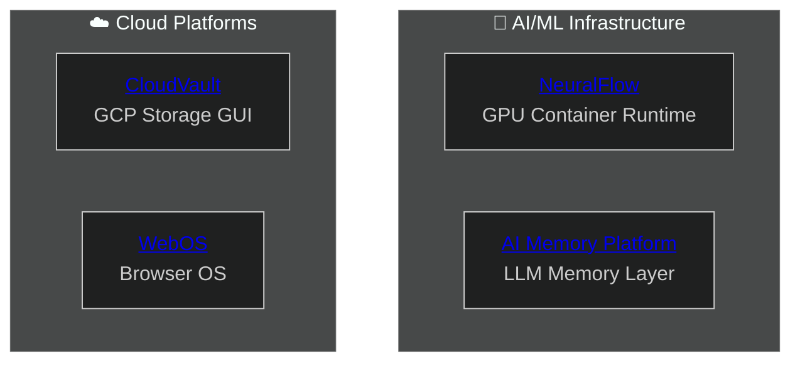
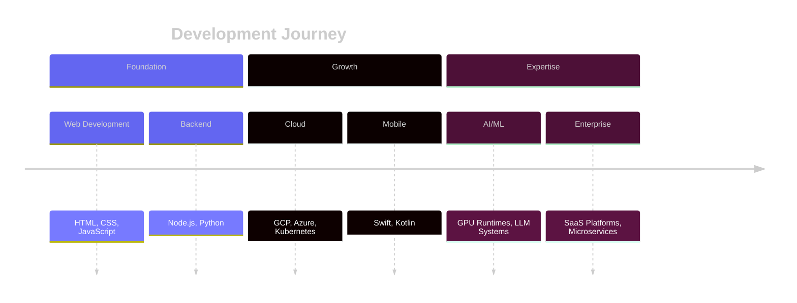

# Yashwanth 🚀

### Full-Stack Engineer • AI/ML Systems • Cloud Infrastructure • Mobile Development

Building production-grade systems that scale to millions of users

---

## 🧠 Tech Universe

---

## 🏗️ System Architecture I Build

---

## 🚀 Featured Projects

---

## 💼 Technical Expertise

| Domain | Stack |
|:------:|:------|
| 🤖 **AI/ML** | GPU Acceleration, CUDA, LLMs, AI Agents, Vector DBs |
| ☁️ **Cloud** | GCP, Azure, Docker, Kubernetes, Terraform |
| 📱 **Mobile** | Swift, Kotlin, Flutter, SwiftUI |
| 🔧 **Backend** | TypeScript, Python, Ruby, Node.js, GraphQL |
| 🎨 **Frontend** | React, Next.js, TailwindCSS |

---

## 📈 Journey

---

### 📊 30+ Repositories | 6+ Languages | Full-Stack to AI/ML

**Open to opportunities in AI Infrastructure, Cloud Platforms & Engineering Leadership**

