```mermaid
%%{init: {'theme': 'dark'}}%%
flowchart LR
    subgraph C["📱 CLIENTS"]
        iOS["iOS"]
        Android["Android"]
        Web["Web"]
    end
    
    subgraph G["⚡ GATEWAY"]
        LB["Load Balancer"]
    end
    
    subgraph S["🔮 SERVICES"]
        Auth["Auth"]
        AI["AI Engine"]
        Core["Core"]
    end
    
    subgraph D["💾 DATA"]
        DB[("SQL")]
        Cache[("Redis")]
        Vec[("Vector")]
    end
    
    subgraph I["☁️ CLOUD"]
        K8s["K8s"]
        GPU["GPU"]
    end
    
    C --> G --> S --> D
    S --> I
```

```mermaid
%%{init: {'theme': 'dark'}}%%
timeline
    title 🔮 JOURNEY
    section 🌱 FOUNDATION
        Web Development : HTML, CSS, JavaScript, Node.js
    section 📈 GROWTH  
        Cloud & Mobile : GCP, Azure, K8s, Swift, Kotlin
    section ⚡ MASTERY
        AI/ML & Enterprise : GPU Runtimes, LLMs, SaaS
```

<div align="center">


<br/>

[](https://github.com/yash1511-bogam)

<br/>

<a href="mailto:yashwanthbogam68@gmail.com"></a>
<a href="https://github.com/yash1511-bogam"></a>

</div>


<div align="center">

</div>

<br/>

<div align="center">

```
                                        ┌─ TypeScript  JavaScript  Python  Swift  Kotlin  Dart  Ruby  HTML  CSS
                                        │
                        ┌── 💻 LANGUAGES ┘
                        │
                        │               ┌─ React  Next.js  SwiftUI  TailwindCSS  Flutter
                        ├── ⚛️ FRONTEND ─┘
                        │
                        │               ┌─ Node.js  GraphQL  REST APIs  Ruby on Rails
                        ├── 🔧 BACKEND ──┘
    ┌───────────────────┤
    │                   │               ┌─ LLM Systems  GPU/CUDA  Neural Networks  Vector DBs  AI Agents
    │  🚀 YASHWANTH     ├── 🤖 AI/ML ───┘
    │                   │
    └───────────────────┤               ┌─ Google Cloud  Azure  DigitalOcean  Kubernetes  Docker  Terraform
                        ├── ☁️ CLOUD ────┘
                        │
                        │               ┌─ iOS Native  Android Native  Cross-platform
                        ├── 📱 MOBILE ──┘
                        │
                        │               ┌─ PostgreSQL  MongoDB  Redis
                        └── 🗄️ DATABASE ┘
```

<br/>

<table>
<tr>
<td align="center"><strong>💻 LANGUAGES</strong></td>
</tr>
<tr>
<td align="center">
&nbsp;&nbsp;
&nbsp;&nbsp;
&nbsp;&nbsp;
&nbsp;&nbsp;
&nbsp;&nbsp;
&nbsp;&nbsp;
&nbsp;&nbsp;
&nbsp;&nbsp;

</td>
</tr>
<tr>
<td align="center"><strong>⚛️ FRONTEND</strong></td>
</tr>
<tr>
<td align="center">
&nbsp;&nbsp;
&nbsp;&nbsp;
&nbsp;&nbsp;

</td>
</tr>
<tr>
<td align="center"><strong>🔧 BACKEND</strong></td>
</tr>
<tr>
<td align="center">
&nbsp;&nbsp;
&nbsp;&nbsp;

</td>
</tr>
<tr>
<td align="center"><strong>🤖 AI/ML</strong></td>
</tr>
<tr>
<td align="center">
&nbsp;&nbsp;

</td>
</tr>
<tr>
<td align="center"><strong>☁️ CLOUD & DEVOPS</strong></td>
</tr>
<tr>
<td align="center">
&nbsp;&nbsp;
&nbsp;&nbsp;
&nbsp;&nbsp;
&nbsp;&nbsp;
&nbsp;&nbsp;

</td>
</tr>
<tr>
<td align="center"><strong>🗄️ DATABASES</strong></td>
</tr>
<tr>
<td align="center">
&nbsp;&nbsp;
&nbsp;&nbsp;

</td>
</tr>
</table>

</div>

<br/>


<div align="center">

</div>

<br/>




<div align="center">

</div>

<br/>

<div align="center">
<table>
<tr>
<td align="center" width="50%">

<br/><br/>
<a href="https://github.com/yash1511-bogam/neuralflow"><strong>AI/ML Container Runtime</strong></a>
<br/><br/>
<em>GPU acceleration • Resource management • High-performance</em>
<br/><br/>


</td>
<td align="center" width="50%">

<br/><br/>
<a href="https://github.com/yash1511-bogam/ai-memory-platform"><strong>Enterprise LLM Memory</strong></a>
<br/><br/>
<em>Production-ready • Enterprise security • Scalable</em>
<br/><br/>


</td>
</tr>
<tr>
<td align="center" width="50%">

<br/><br/>
<a href="https://github.com/yash1511-bogam/cloudvault"><strong>GCP Storage Management</strong></a>
<br/><br/>
<em>Modern UI • Secure • Intuitive interface</em>
<br/><br/>


</td>
<td align="center" width="50%">

<br/><br/>
<a href="https://github.com/yash1511-bogam/webos"><strong>Browser Operating System</strong></a>
<br/><br/>
<em>Glassmorphism • Real-time • System management</em>
<br/><br/>


</td>
</tr>
</table>
</div>


<div align="center">

</div>

<br/>




<div align="center">


<br/><br/>

<a href="mailto:yashwanthbogam68@gmail.com">

</a>

<br/><br/>


</div>
