```mermaid
%%{init: {'theme': 'base', 'themeVariables': { 'primaryColor': '#7c3aed', 'primaryTextColor': '#06b6d4', 'primaryBorderColor': '#ec4899', 'lineColor': '#06b6d4', 'secondaryColor': '#1a1a2e', 'tertiaryColor': '#0f0f0f', 'background': '#0f0f0f', 'mainBkg': '#0f0f0f', 'nodeBorder': '#ec4899', 'clusterBkg': '#1a1a2e', 'titleColor': '#ffffff', 'nodeTextColor': '#ffffff'}}}%%
mindmap
  root((🚀 STACK))
    🤖 AI & ML
      GPU Acceleration
      LLM Systems
      Neural Networks
      AI Agents
      Vector DBs
    ☁️ CLOUD
      GCP
      Azure
      Kubernetes
      Docker
      Terraform
    📱 MOBILE
      Swift iOS
      Kotlin Android
      Flutter
      SwiftUI
    ⚡ BACKEND
      TypeScript
      Python
      Ruby
      Node.js
      GraphQL
    🎨 FRONTEND
      React
      Next.js
      TailwindCSS
```

```mermaid
%%{init: {'theme': 'base', 'themeVariables': { 'primaryColor': '#7c3aed', 'primaryTextColor': '#ffffff', 'primaryBorderColor': '#06b6d4', 'lineColor': '#ec4899', 'secondaryColor': '#1a1a2e', 'tertiaryColor': '#0f0f0f', 'background': '#0f0f0f', 'textColor': '#ffffff', 'nodeTextColor': '#ffffff'}}}%%
flowchart LR
    subgraph C["📱 CLIENTS"]
        iOS["iOS"]
        Android["Android"]
        Web["Web"]
    end
    
    subgraph G["⚡ GATEWAY"]
        LB["Load Balancer"]
    end
    
    subgraph S["🔮 SERVICES"]
        Auth["Auth"]
        AI["AI Engine"]
        Core["Core"]
    end
    
    subgraph D["💾 DATA"]
        DB[("SQL")]
        Cache[("Redis")]
        Vec[("Vector")]
    end
    
    subgraph I["☁️ CLOUD"]
        K8s["K8s"]
        GPU["GPU"]
    end
    
    C --> G --> S --> D
    S --> I
```
 

 

 

 

 

 

<table>
<tr>
<td align="center" width="50%">

  
<a href="https://github.com/yash1511-bogam/neuralflow"><strong>AI/ML Container Runtime</strong></a>
  
<em>GPU acceleration • Resource management • High-performance</em>
  

</td>
<td align="center" width="50%">

  
<a href="https://github.com/yash1511-bogam/ai-memory-platform"><strong>Enterprise LLM Memory</strong></a>
  
<em>Production-ready • Enterprise security • Scalable</em>
  

</td>
</tr>
<tr>
<td align="center" width="50%">

  
<a href="https://github.com/yash1511-bogam/cloudvault"><strong>GCP Storage Management</strong></a>
  
<em>Modern UI • Secure • Intuitive interface</em>
  

</td>
<td align="center" width="50%">

  
<a href="https://github.com/yash1511-bogam/webos"><strong>Browser Operating System</strong></a>
  
<em>Glassmorphism • Real-time • System management</em>
  

</td>
</tr>
</table>

 

  

  

