```mermaid
%%{init: {'theme': 'base', 'themeVariables': { 'primaryColor': '#7c3aed', 'primaryTextColor': '#ffffff', 'primaryBorderColor': '#06b6d4', 'lineColor': '#06b6d4', 'secondaryColor': '#0d0d0d', 'tertiaryColor': '#1a1a2e', 'background': '#0d0d0d', 'mainBkg': '#1a1a2e', 'nodeBorder': '#7c3aed', 'clusterBkg': '#1a1a2e', 'titleColor': '#06b6d4'}}}%%
mindmap
  root((🚀 YASHWANTH))
    🤖 AI/ML
      GPU Acceleration
      LLM Systems
      Neural Networks
      AI Agents
      Vector DBs
    ☁️ Cloud
      GCP
      Azure
      Kubernetes
      Docker
      Terraform
    📱 Mobile
      Swift iOS
      Kotlin Android
      Flutter
      SwiftUI
    ⚡ Backend
      TypeScript
      Python
      Ruby
      Node.js
      GraphQL
    🎨 Frontend
      React
      Next.js
      TailwindCSS
```

```mermaid
%%{init: {'theme': 'base', 'themeVariables': { 'primaryColor': '#7c3aed', 'primaryTextColor': '#fff', 'primaryBorderColor': '#06b6d4', 'lineColor': '#06b6d4', 'secondaryColor': '#1a1a2e', 'tertiaryColor': '#0d0d0d', 'background': '#0d0d0d'}}}%%
flowchart LR
    subgraph C["🖥️ CLIENTS"]
        direction TB
        iOS["📱 iOS"]
        Android["🤖 Android"]
        Web["🌐 Web"]
    end
    
    subgraph G["⚡ GATEWAY"]
        LB["Load Balancer"]
    end
    
    subgraph S["🔮 SERVICES"]
        direction TB
        Auth["🔐 Auth"]
        AI["🧠 AI Engine"]
        Core["⚙️ Core"]
    end
    
    subgraph D["💾 DATA"]
        direction TB
        DB[("PostgreSQL")]
        Cache[("Redis")]
        Vec[("Vector DB")]
    end
    
    subgraph I["☁️ INFRA"]
        K8s["Kubernetes"]
        GPU["GPU Cluster"]
    end
    
    C --> G --> S --> D
    S --> I
```
 

 

 

##  Tech Stack

 

##  System Architecture

 

##  Featured Projects

<table>
<tr>
<td width="50%" align="center">
<h3><a href="https://github.com/yash1511-bogam/neuralflow">⚡ NeuralFlow</a></h3>

<strong>AI/ML Container Runtime</strong>

GPU acceleration • Resource management • High-performance pipelines

</td>
<td width="50%" align="center">
<h3><a href="https://github.com/yash1511-bogam/ai-memory-platform">🧠 AI Memory Platform</a></h3>

<strong>Enterprise LLM Memory Layer</strong>

Production-ready • Enterprise security • Scalable

</td>
</tr>
<tr>
<td width="50%" align="center">
<h3><a href="https://github.com/yash1511-bogam/cloudvault">☁️ CloudVault</a></h3>

<strong>GCP Storage Management</strong>

Modern UI • Secure • Intuitive

</td>
<td width="50%" align="center">
<h3><a href="https://github.com/yash1511-bogam/webos">🌐 WebOS</a></h3>

<strong>Browser Operating System</strong>

Glassmorphism • Real-time • System management

</td>
</tr>
</table>

 

##  Journey

 

### 📊 `30+ Repos` • `6+ Languages` • `Full-Stack → AI/ML`

 

**Open to opportunities in AI Infrastructure, Cloud Platforms & Engineering Leadership**

 

 

